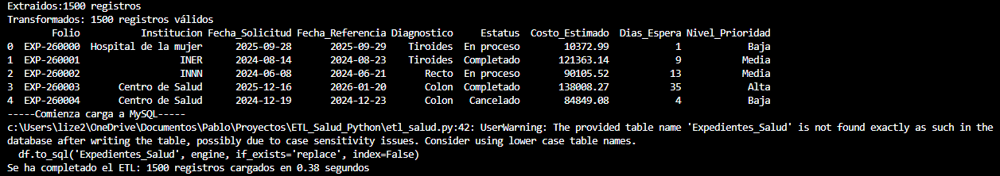
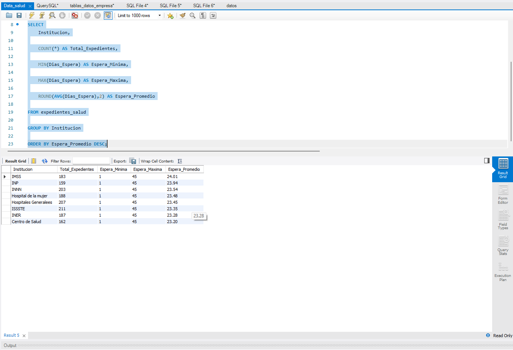

# ETL Salud: Automatización de 40+ min → 0.38 seg

Pipeline ETL desarrollado con Python para procesar 1500+ expedientes hospitalarios. Reduce un proceso manual de 40+ minutos a **0.38 segundos**. 99.8% de ahorro de tiempo operativo.

## 🎯 Problema de Negocio
El área de Referencias del sector salud procesaba expedientes en Excel manualmente. 40+ minutos semanales en limpieza, cálculo de días de espera y clasificación de prioridad. Alto riesgo de error humano.

## ⚡ Solución Implementada
Pipeline ETL automatizado que ejecuta Extract, Transform y Load en **0.38 segundos**:

1. **Extract**: Generación de 1500 registros sintéticos con `Faker` simulando datos reales hospitalarios
2. **Transform**: Limpieza con `Pandas` + cálculo de KPIs: `Dias_Espera` y `Nivel_Prioridad` automatizado
3. **Load**: Carga masiva a `MySQL` usando `SQLAlchemy` + `PyMySQL`
4. **Analyze**: Queries SQL para obtener espera promedio, máxima y mínima por institución

## 🛠️ Tecnologías
`Python` • `Pandas` • `Faker` • `PyMySQL` • `MySQL` • `VS Code`

## 📊 Evidencia del Proyecto

### 1. Velocidad del Pipeline

**Resultado: 1500 registros procesados en 0.38 segundos**

### 2. KPIs de Negocio Generados en SQL

Métricas por institución: Total expedientes, Espera mínima/máxima/promedio

## 💡 KPIs de Negocio Entregados
- **Días de Espera**: Cálculo automático entre solicitud y referencia
- **Nivel de Prioridad**: Clasificación Alta/Media/Baja según días de espera
- **Validación de Datos**: Detección automática de fechas ilógicas
- **Análisis por Institución**: Agrupación con `GROUP BY` para toma de decisiones

